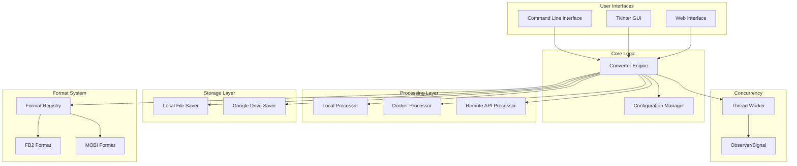
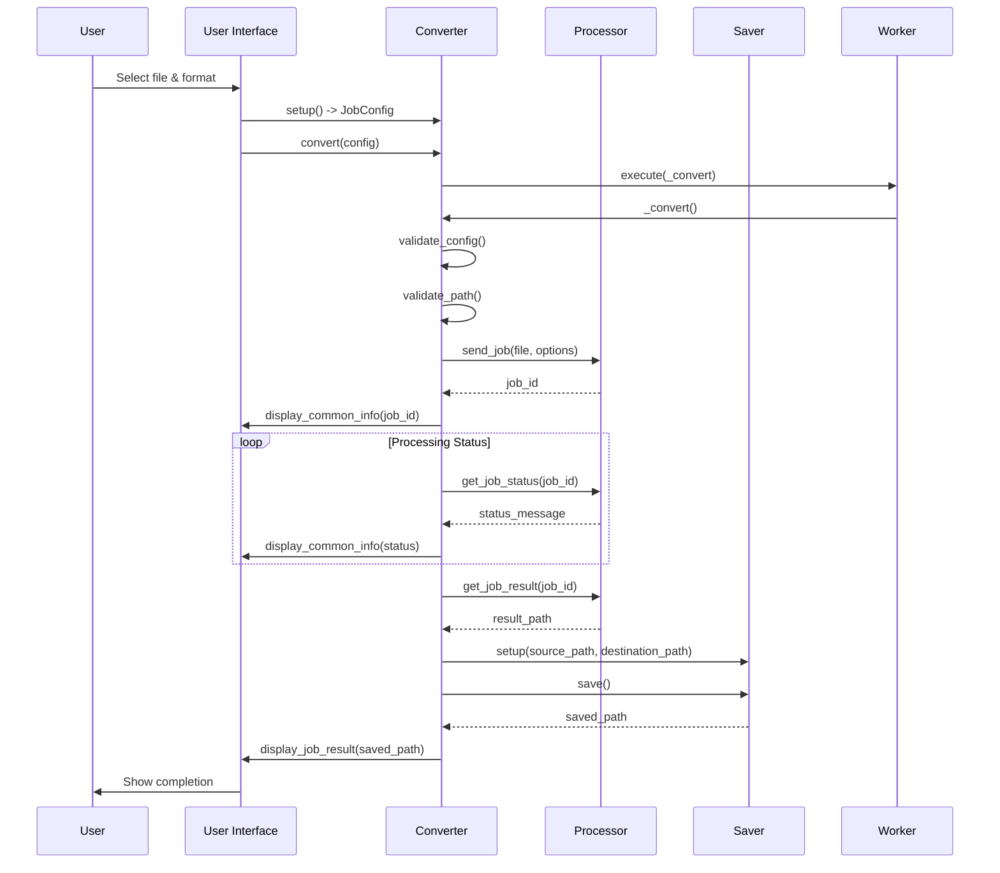
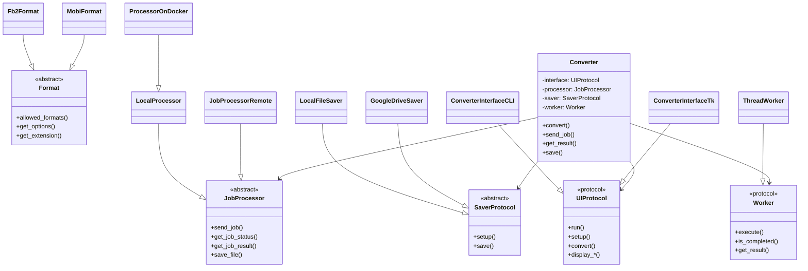
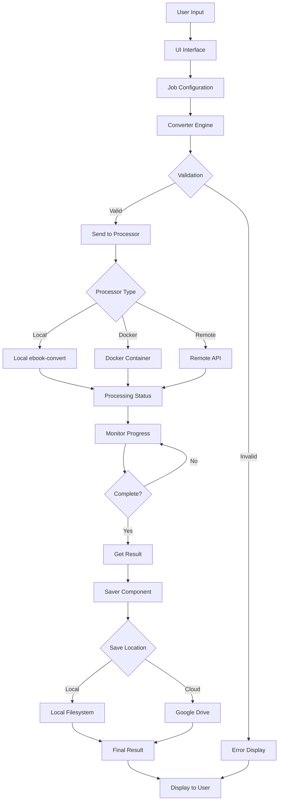
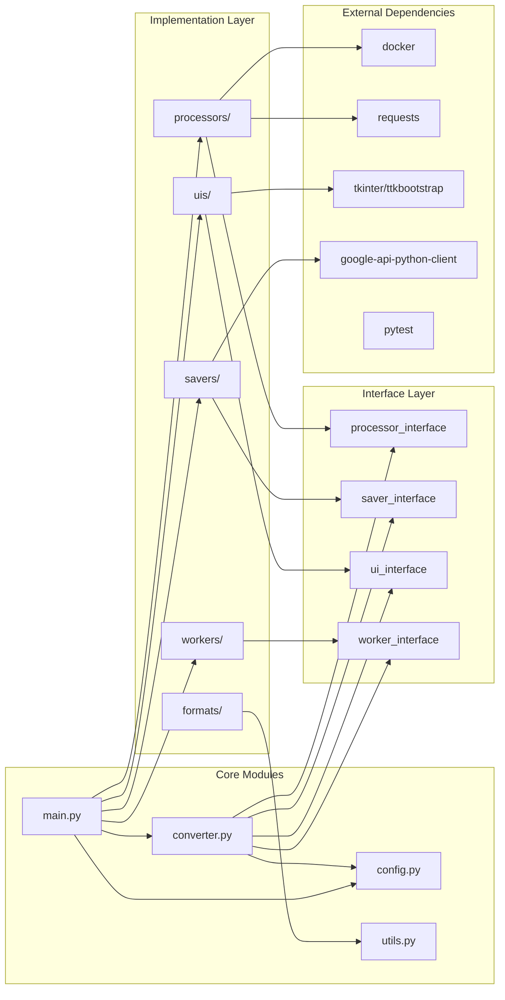
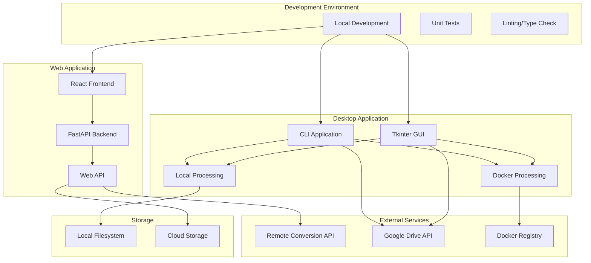
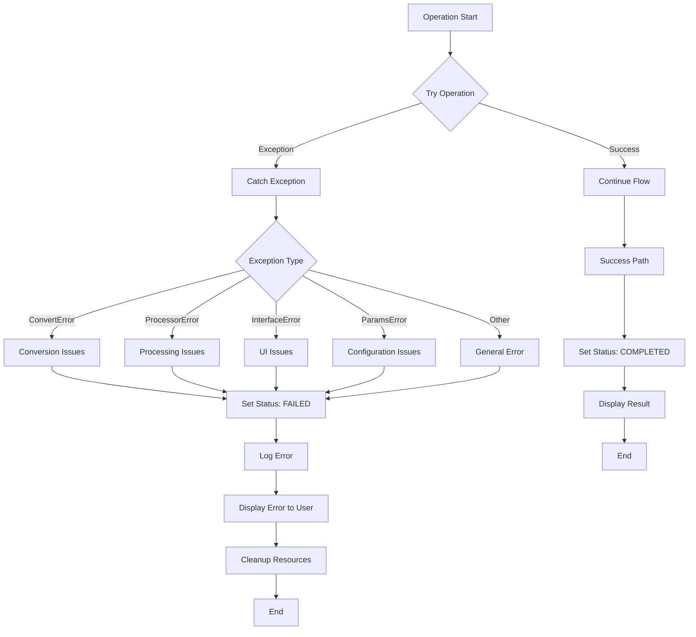
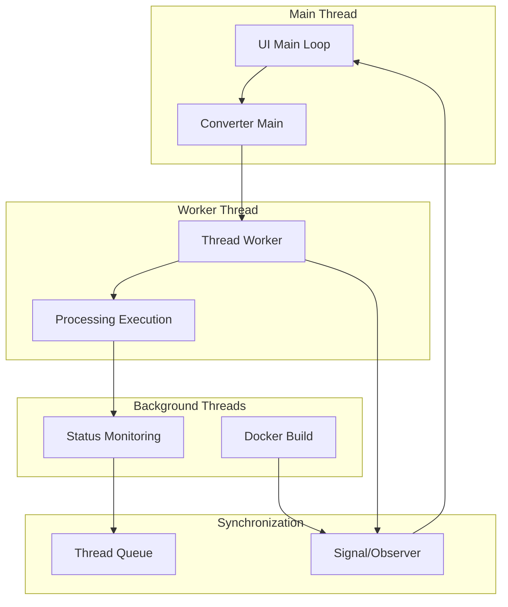
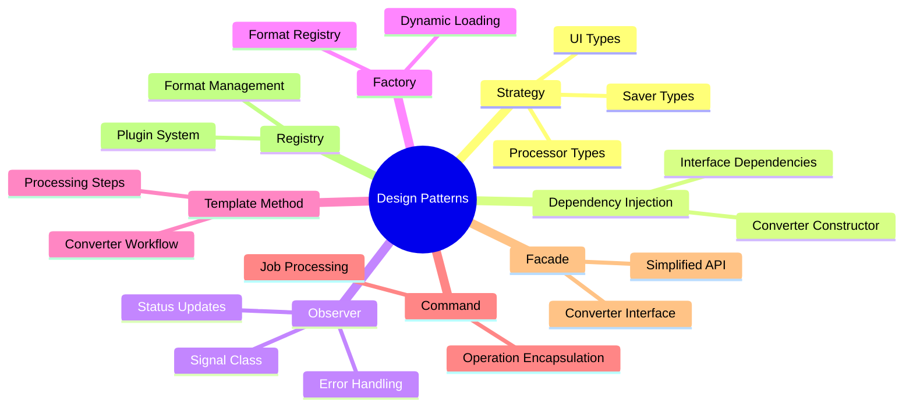

# E-book Converter - Architecture Diagrams

This document contains various architectural diagrams that illustrate the structure and relationships within the E-book Converter project.

## System Architecture Overview

## Component Interaction Flow

## Class Hierarchy Diagram

## Data Flow Diagram

## Package Dependencies

## Deployment Architecture

## Error Handling Flow

## Threading Model

## Design Patterns Map

These diagrams provide multiple perspectives on the architecture:

1. **System Architecture** - High-level component overview
2. **Component Interaction** - How components communicate
3. **Class Hierarchy** - Inheritance and implementation relationships
4. **Data Flow** - How data moves through the system
5. **Package Dependencies** - Module dependencies and external libraries
6. **Deployment Architecture** - Different deployment scenarios
7. **Error Handling** - Error propagation and handling
8. **Threading Model** - Concurrency and synchronization
9. **Design Patterns** - Applied patterns and their purposes

Each diagram focuses on a specific aspect of the system to provide clear understanding of the architecture from different viewpoints.