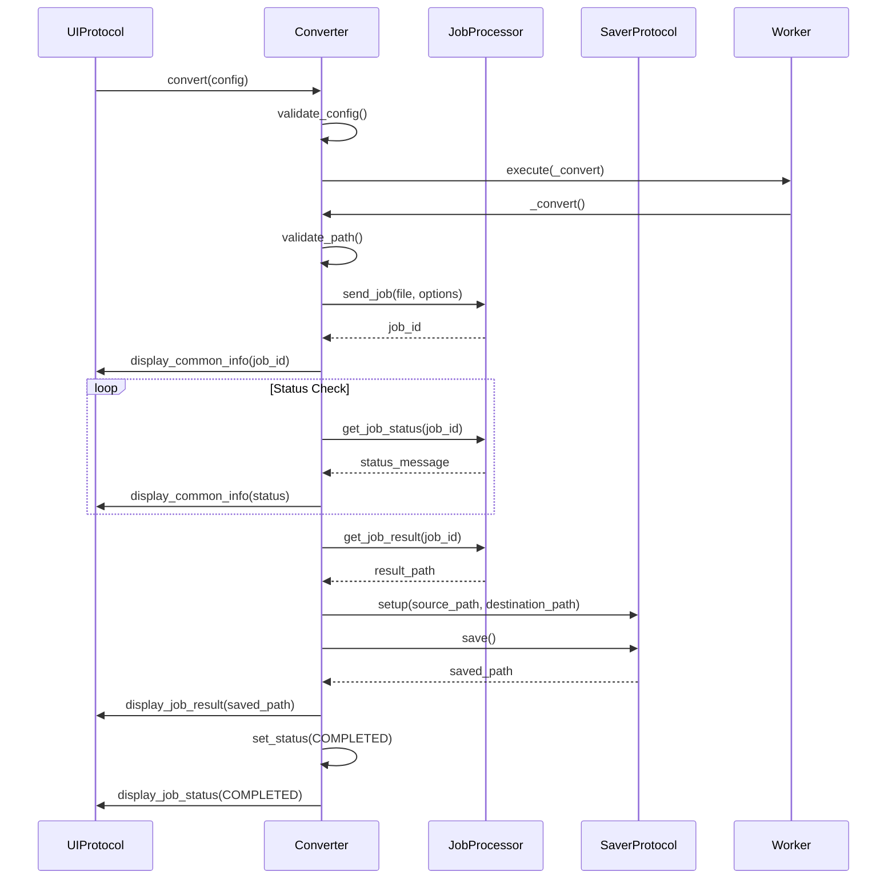
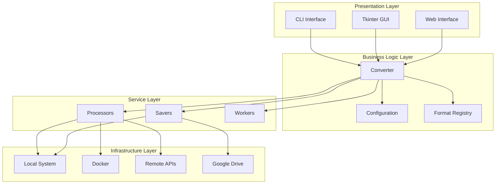

# E-book Converter - UML Class Diagram

This document contains the UML class diagram for the E-book Converter project, showing the relationships between classes, interfaces, and their implementations.

## Class Diagram

```mermaid
classDiagram
    %% Core Classes
    class Converter {
        -interface: UIProtocol
        -processor: JobProcessor
        -saver: SaverProtocol
        -worker: Worker
        -config: JobConfig
        -status: ConverterStatus
        +convert(config: JobConfig)
        +send_job() int
        +get_result(job_id: int) str
        +save(source_path: str) Path
        +error_handler(error: Exception)
        +validate_path(path: str) bool
        +set_status(status: ConverterStatus)
        +get_status() str
        +set_config(config: JobConfig)
        +set_converter_executor() Callable
        +validate_config()
        +get_file_path() str
        +get_job_options() dict
    }

    %% Configuration Classes
    class JobConfig {
        +target: Target
        +path_to_file: str
        +path_to_save: str
        +job_target: str
        +job_category: str
        +job_options: dict
        +get_config() dict
    }

    class Target {
        +target: str
        +category: str
        +options: dict
    }

    class APIConfig {
        +token: str
        +url: str
        +headers: dict
        +get_header(key: str) dict
        +set_header(key: str, data: dict)
    }

    %% Enums
    class ConverterStatus {
        <<enumeration>>
        READY
        PROCESSING
        FAILED
        COMPLETED
    }

    %% Abstract Interfaces
    class JobProcessor {
        <<abstract>>
        +send_job(filename: str, options: dict) int
        +get_job_status(job_id: int) Generator
        +get_job_result(job_id: int) str
        +save_file(path_to_result: str, path_to_save: Path) Path
    }

    class SaverProtocol {
        <<abstract>>
        +setup(**kwargs) void
        +save(source_path: str) Path
    }

    class UIProtocol {
        <<protocol>>
        +run(converter: Converter)
        +setup() JobConfig
        +convert(config: JobConfig)
        +display_job_status(status: str)
        +display_job_result(result: Path)
        +display_job_id(job_id: str)
        +display_common_info(message: str, status: str)
        +display_error(error: str, status: ConverterStatus)
    }

    class Worker {
        <<protocol>>
        +is_completed() bool
        +get_result() Any
        +execute(func: Callable, *args, **kwargs)
        +set_error_handler(handler: Callable)
    }

    %% Processor Implementations
    class LocalProcessor {
        -processes: dict[int, tuple]
        +_prepare_command(filename: str, options: dict) dict
        +_get_process(job_id: int) subprocess.Popen
        +_resolve_path(path_to_result: str, destination_dir: Path) Path
        +_prepare_other_options(options: dict) list
        +_get_job_status(process: subprocess.Popen) Generator
    }

    class ProcessorOnDocker {
        -client: DockerClient
        -containers: dict[int, tuple]
        +set_docker_client(client: DockerClient)
        +_get_container(job_id: int) Container
        +init_container(rebuild: bool, callback: Callable) DockerClient
        +build_image(dockerfile_path: str, tag: str, callback: Callable)
        +start_build(dockerfile_path: str, tag: str, callback: Callable)
    }

    class JobProcessorRemote {
        -api_config: APIConfig
        -_status: str
        +_send_job_data(path: str, file_data: TextIO, options: dict) int
        +_get_job_info(job_id: int) dict
        +is_completed() bool
        +set_status(status: str)
        +_prepare_status(status_code: str) ConverterStatus
        +_set_data_options(options: dict) str
        +_get_job_id_from_server(options_data: str) tuple[int, str]
        +_set_upload_url(job_id: int, server_url: str) str
        +_send_file_to_server(server_url: str, path_to_file: str, file_data: TextIO) dict
        +_get_job_status(job_id: int) dict
        +_get_job_result(job_id: int) str
        +_check_errors(data: dict)
        +_get_error_info(data: dict) list[str]
        +_save_from_url(url: str, sub_dir: Path) Path
    }

    %% Saver Implementations
    class LocalFileSaver {
        -destination_path: Path
        -source_path: str
    }

    class GoogleDriveSaver {
        -service: GoogleDriveService
        -source_path: str
        +init_gdrive_service() GoogleDriveService
    }

    %% UI Implementations
    class ConverterInterfaceCLI {
        -converter: Converter
        -docstring: str
        +_get_params(args: list) tuple
        +_print(msg: str)
        +yes_no(message: str) bool
    }

    class ConverterInterfaceTk {
        -view: TkView
        -converter: Converter
        -config: JobConfig
        +_get_params() tuple
        +get_config() JobConfig
    }

    class TkView {
        -interface: ConverterInterfaceTk
        -root: ttkb.Window
        -_config: dict
        +create_view()
        +interface_convert() bool
        +open_file()
        +download_result(filename: str, content: bytes)
        +bind_convert_direction_from(event)
        +bind_convert_direction_to(event)
        +bind_open_file_tap(event)
        +set_config()
        +set_data(key: Any, value: Any)
        +processing_error(error: str)
        +processing_result(result: Path, content: bytes)
        +add_text_message(message: str)
        +update_text_message(message: str)
        +set_status(msg: str)
        +get_param(key: str) Any
        +show_message(message: str, message_type: str)
        +run()
    }

    %% Worker Implementations
    class ThreadWorker {
        -_thread: Thread
        -_result: Any
        -_error: Signal
        +wrapper(func: Callable, *args, **kwargs)
    }

    class Signal {
        -handlers: list[Callable]
        +emit(*args, **kwargs)
        +connect(handler: Callable)
        +disconnect(handler: Callable)
    }

    %% Format System
    class Format {
        <<abstract>>
        +format_name: str
        +allowed_formats() list
        +get_options() dict
        +get_extension() str
    }

    class Fb2Format {
        +allowed_formats() list
        +get_extension() str
        +get_option() dict
    }

    class MobiFormat {
        +allowed_formats() list
        +get_extension() str
        +get_option() dict
    }

    %% Helper Classes
    class TextRedirector {
        -widget: UIProtocol
        -tag: str
        +write(message: str)
        +flush()
    }

    %% Utility Classes
    class Utils {
        <<utility>>
        +coroutine(func: Callable) Callable
        +catcher(error_list: list) Callable
        +get_value(arg: str) str | bool | None
        +get_path(file_name: str) str
        +parse_command() dict
        +save_from_url(url: str, sub_dir: str) Path
        +get_full_file_path(filename: str, sub_dir: Path) Path
        +save_data_from_response_to_dir(file_path: Path, response: Response, bufsize: int)
    }

    %% Main Entry Point
    class Main {
        <<module>>
        +main()
        +load_formats()
    }

    %% Relationships
    Converter --> JobConfig : uses
    Converter --> UIProtocol : depends on
    Converter --> JobProcessor : depends on
    Converter --> SaverProtocol : depends on
    Converter --> Worker : depends on
    Converter --> ConverterStatus : uses

    JobConfig --> Target : contains
    
    LocalProcessor --|> JobProcessor : implements
    ProcessorOnDocker --|> LocalProcessor : extends
    JobProcessorRemote --|> JobProcessor : implements
    
    LocalFileSaver --|> SaverProtocol : implements
    GoogleDriveSaver --|> SaverProtocol : implements
    
    ConverterInterfaceCLI --|> UIProtocol : implements
    ConverterInterfaceTk --|> UIProtocol : implements
    
    ThreadWorker --|> Worker : implements
    
    ConverterInterfaceTk --> TkView : contains
    TkView --> ConverterInterfaceTk : references
    
    ThreadWorker --> Signal : uses
    
    ProcessorOnDocker --> TextRedirector : uses
    TextRedirector --> UIProtocol : redirects to
    
    JobProcessorRemote --> APIConfig : uses
    
    Fb2Format --|> Format : extends
    MobiFormat --|> Format : extends
    
    Main --> Converter : creates
    Main --> Utils : uses
    
    %% Exception Classes - Base
    class ConverterError {
        <<exception>>
        +message: str
        +error_code: str
        +details: dict
    }
    
    %% Configuration Exceptions
    class ConfigurationError {
        <<exception>>
        +message: str
    }
    
    class ParamsError {
        <<exception>>
        +message: str
    }
    
    class APIConfigError {
        <<exception>>
        +message: str
    }
    
    %% Processing Exceptions
    class ProcessingError {
        <<exception>>
        +message: str
    }
    
    class ProcessorError {
        <<exception>>
        +message: str
    }
    
    class LocalProcessorError {
        <<exception>>
        +message: str
    }
    
    class DockerProcessorError {
        <<exception>>
        +message: str
    }
    
    class RemoteProcessorError {
        <<exception>>
        +message: str
    }
    
    %% Storage Exceptions
    class StorageError {
        <<exception>>
        +message: str
    }
    
    class SaverError {
        <<exception>>
        +message: str
    }
    
    class LocalSaverError {
        <<exception>>
        +message: str
    }
    
    class CloudSaverError {
        <<exception>>
        +message: str
    }
    
    class GoogleDriveError {
        <<exception>>
        +message: str
    }
    
    %% Interface Exceptions
    class InterfaceError {
        <<exception>>
        +message: str
    }
    
    class UIError {
        <<exception>>
        +message: str
    }
    
    class CLIError {
        <<exception>>
        +message: str
    }
    
    class GUIError {
        <<exception>>
        +message: str
    }
    
    %% Concurrency Exceptions
    class ConcurrencyError {
        <<exception>>
        +message: str
    }
    
    class WorkerError {
        <<exception>>
        +message: str
    }
    
    class ThreadError {
        <<exception>>
        +message: str
    }
    
    %% Format Exceptions
    class FormatError {
        <<exception>>
        +message: str
    }
    
    class UnsupportedFormatError {
        <<exception>>
        +message: str
    }
    
    class FormatValidationError {
        <<exception>>
        +message: str
    }

    %% Exception Inheritance Hierarchy
    ConfigurationError --|> ConverterError : extends
    ProcessingError --|> ConverterError : extends
    StorageError --|> ConverterError : extends
    InterfaceError --|> ConverterError : extends
    ConcurrencyError --|> ConverterError : extends
    FormatError --|> ConverterError : extends
    
    ParamsError --|> ConfigurationError : extends
    APIConfigError --|> ConfigurationError : extends
    
    ProcessorError --|> ProcessingError : extends
    LocalProcessorError --|> ProcessorError : extends
    DockerProcessorError --|> ProcessorError : extends
    RemoteProcessorError --|> ProcessorError : extends
    
    SaverError --|> StorageError : extends
    LocalSaverError --|> SaverError : extends
    CloudSaverError --|> SaverError : extends
    GoogleDriveError --|> CloudSaverError : extends
    
    UIError --|> InterfaceError : extends
    CLIError --|> InterfaceError : extends
    GUIError --|> InterfaceError : extends
    
    WorkerError --|> ConcurrencyError : extends
    ThreadError --|> ConcurrencyError : extends
    
    UnsupportedFormatError --|> FormatError : extends
    FormatValidationError --|> FormatError : extends
    
    %% Exception Usage
    Converter --> ConverterError : throws
    JobProcessor --> ProcessorError : throws
    LocalProcessor --> LocalProcessorError : throws
    ProcessorOnDocker --> DockerProcessorError : throws
    JobProcessorRemote --> RemoteProcessorError : throws
    SaverProtocol --> StorageError : throws
    LocalFileSaver --> LocalSaverError : throws
    GoogleDriveSaver --> GoogleDriveError : throws
    UIProtocol --> InterfaceError : throws
    JobConfig --> ParamsError : throws
    ThreadWorker --> ConcurrencyError : throws

    %% Registry Pattern
    class FormatRegistry {
        <<singleton>>
        +registry: dict
        +load_formats()
        +register_format(format_name: str) Callable
    }

    FormatRegistry --> Format : manages
    Format --> FormatRegistry : registers with
```

## Component Interaction Diagrams

### Sequence Diagram: Conversion Process

### Component Diagram: Architecture Layers

## Design Pattern Summary

| Pattern | Implementation | Purpose |
|---------|---------------|---------|
| **Strategy** | Processor/UI/Saver interfaces | Interchangeable algorithms |
| **Dependency Injection** | Converter constructor | Loose coupling, testability |
| **Template Method** | Converter._convert() | Define algorithm skeleton |
| **Observer** | Signal class | Event notification |
| **Factory** | Format registry | Object creation |
| **Command** | Job processing | Encapsulate operations |
| **Facade** | Converter class | Simplified interface |
| **Registry** | Format loading | Plugin management |

## Key Relationships

### Inheritance Hierarchies
- `ProcessorOnDocker` extends `LocalProcessor`
- `Fb2Format`, `MobiFormat` extend `Format`
- All custom exceptions extend `Exception`

### Composition Relationships
- `Converter` contains `JobConfig`, interfaces
- `ConverterInterfaceTk` contains `TkView`
- `ThreadWorker` contains `Signal`
- `JobConfig` contains `Target`

### Interface Implementations
- Multiple concrete classes implement each protocol
- Enables polymorphism and substitutability
- Facilitates testing with mock implementations

This UML diagram shows the complete architecture of the e-book converter, demonstrating how the various components interact through well-defined interfaces and established design patterns.